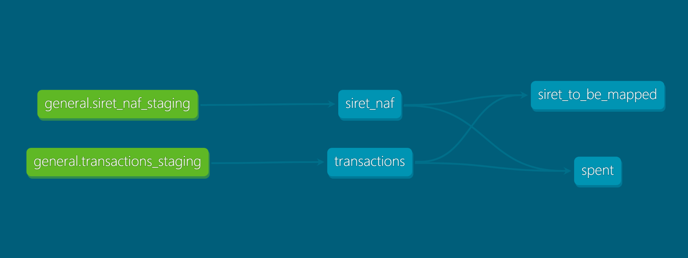

# Introduction
This is a Data Engineering project for **Swile** interview.
We have fake transactions data that is stored on MinIO storage system, and
we'd like to load it into a database of choice, then generate a daily report table.
Ideally The database should be an analytical database (data warehouse)
but for the purpose of simplicity we'll use  postgresql.

# Project Description
I'll be describing here project structure both logically and in term of files.

The project is structured around two main parts
- **airflow_dags**: contain the logic for loading data and writing data as well as two dags.
    DBT operations and models are run from python and not directly from cmd.
  - **daily_transactions_load_dag**: Main DAG that will load data, map siret and generate report.
  - **postgres_db_init_dag**: Run one time only, this dag is responsible for initializing 
    postgres database
- **dbt**: This folder contains all queries to move data from staging tables into production.
    as well as the query for generating the reporting table. One particular model stands out,
    **siret_to_be_mapped** that contain the list of siret that we don't have their naf_code yet.
    This allow less API calls which make execution time much faster.
- **various scripts**: DAG logic is hidden in three scripts for better readability
  - **load_event_data**: scrit that contain logic to load data and move it to prod table.
    Runs DBT commands
  - **curate_naf_code**: scrit that contain logic to request INSEE API and write siret <-> naf_code mapping
    back. Runs DBT commands
  - **postgres_db_init_dag**: script that init postgres db
  - **constants**: contain configuration for the project. Has config depending on whether it's
    run locally or from server
  - **others**: various other necessary files. Some files that stands out
    - **profiles**: Contain DB profiles for DBT otherwise DBT will use default one.
    - **Dockerfile**: **[WIP]** Dockerfile for airflow server
    - **docker-compose**: **[WIP]** The initial docker-compose.yml with added postgres and airflow.
        still WIP and have some issues

# Running The Project
1. Installing libraries (postgres, airflow)
On windows you can install postgres through the installer, airflow can't run on windows
but you can still install it as a library.

On linux do
```bash
sudo apt install postgresql  postgresql-contrib build-essensial libpq-dev -y
```
1. Install dependancies from the requirements.txt
```
pip install "apache-airflow[celery]==2.8.1" --constraint "https://raw.githubusercontent.com/apache/airflow/constraints-2.8.1/constraints-3.8.txt"
pip install -r requirements.txt
```

## Changes to be done before running
Make sure you change postgres password to the one you choose or password as the default 
in docker image

## Running scripts manually

```bash
# python path is the out-most folder in order to find swile.*
# as airflow recommend (more like force us) to use company / top package name and not relative
# import 
cd  ~/path-to-top-folder/swile
$ PYTHONPATH=../ python ~/path-to-top-folder/swile/airflow_dags/postgres_db_init_dag.py
$ PYTHONPATH=../ python ~/path-to-top-folder/swile/airflow_dags/load_event_data.py --object_name 2023-10-01
$ PYTHONPATH=../ python ~/path-to-top-folder/swile/airflow_dags/curate_naf_code.py
```

## Running from Airflow
Copy top level folder to airflow dags
```bash
cd airflow/dags
cp -r <path-to-dir>/swile/ .
```
I need to mention that due to a connection issue between postgresql and airflow (running from wsl),
I wasn't able to fully test the DAG. The DAG itself is simple and doesn't have complicated logic as 
logic from individual scripts has been well tested, hopefully there isn't an issue in the dag or none that are difficult 
to fix.

I tried to fix the issue by using docker-compose with two image for both postgres and airflow,
but I had few issues that need to be solved and it's still WIP.


# DBT Table 



# Future feature plan and enhancements

- Fixing Airflow deployment image and docker-compose.yml
- Define table access control by hide staging tables and assigning read access to dev roles only
- Move to an analytical database instead of transaction database
- Re-partition bucket by year and month. This should in theory increase preformance when
    we have a lot of files in the bucket
- Adding DBT documentation to each table
- Adding DBT tests on different tables specially final `spent`
- Using airflow Sensors instead of operators to detect when a file is added to bucket
- Using python PythonVirtualenvOperator to run ORM code as need a different version of 
    SQLAlchemy that is not compatible with Airflow. This is to avoid security issues
    with SQL injecting when inserting data with connectors.
- Converting some functions to OOP
- Adding unittests to unit functions used.
- Either add API token to contants and encrypt the file using git-secret or
    refactor code and store token in airflow connections 
